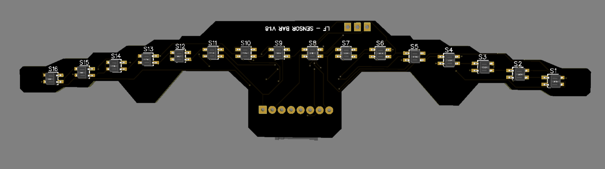

# 16 Sensors Bar Line Follower Bar

This module is designed with **16 QRE1113GR phototransistor sensors**, spaced `~6 mm` apart to provide high-resolution line detection, ideal for precision line-following robots.

- **Optimal Sensing Distance**: `3 mm`
- **Output Format**: Analog only
- **Connector**: FFC/FPC connection to main board

## Overview

The **16 Sensors Line Follower Bar** enables fast and accurate line detection with its closely spaced QRE1113GR sensors. Built for competitive robotics, it offers reliable tracking in various lighting conditions, making it suitable for high-speed applications.
